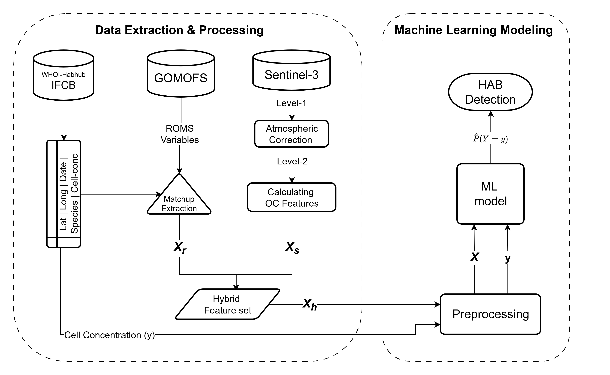

# HybridHAB Detection

Satellite and ocean-model pipeline for multi-species harmful algal bloom (HAB) detection in the Gulf of Maine, developed for a HAB risk assessment application.

The core question this codebase answers: **does combining ocean-colour remote sensing with a regional ocean model (ROMS) improve HAB detection over ocean colour alone?** Sentinel-3 OLCI reflectance is matched against IFCB (Imaging FlowCytobot) observations from the HABHub network (2017–2025) across three atmospheric correction pipelines, and machine learning models are trained on ocean-colour-only versus hybrid (ocean colour + ROMS) feature sets. The hybrid model outperforms the ocean-colour-only model across all three atmospheric correction pipelines and across all spatial cross-validation schemes tested.

## Pipeline overview



Sentinel-3 OLCI scenes are processed through three independent atmospheric correction pipelines (ACOLITE, C2RCC, and the ESA baseline processor, OC-SAC). Spectral features from each pipeline are matched in space and time to IFCB species-level cell counts, and merged with ROMS-derived physical variables (temperature, salinity, currents) at ±1 and ±2 day lags. Two parallel models are trained on this composite dataset per pipeline: an ocean-colour-only model and a hybrid model with ROMS features added. All models are evaluated with spatial cross-validation (grid, quadtree, and clustering-based blocking) to test generalisation to unseen locations, in addition to standard random cross-validation.

## Target species

Detection is framed as multi-label binary classification: each matchup is labelled bloom-present or bloom-absent per species against a warning and a closure cell-density threshold.

| Species | Warning (cells/L) | Closure (cells/L) |
|---|---|---|
| *Alexandrium catenella* | 100 | 300 |
| *Dinophysis acuminata* | 200 | 500 |
| *Dinophysis norvegica* | 200 | 500 |
| *Karenia* spp. | 1,000 | 5,000 |
| *Pseudo-nitzschia* spp. | 2,000 | 13,000 |
| *Margalefidinium* | 1,000 | 6,000 |

The first five taxa are the primary classification targets. *Margalefidinium* has insufficient bloom-level observations for reliable classification and is reported in the regression track only.

## Repository structure

```
├── data_prep/                          # raw data acquisition and feature extraction
│   ├── 0-extract_IFCB_data.py          # pull IFCB species counts from the HABHub API
│   ├── 1.0-prepare_S3_L1_list_GOM.py   # build GoMOFS/ROMS download URL list from IFCB dates
│   ├── 1.1-s3_olci_downloader.py       # download Sentinel-3 OLCI L1 scenes (CDSE)
│   ├── 2.12-acolite_processor_filelist.py  # run ACOLITE atmospheric correction
│   ├── 2.22-c2rcc_run.py               # run C2RCC atmospheric correction (SNAP/GPT)
│   ├── 4-download_roms_data.py         # download GoMOFS/ROMS ocean model output
│   ├── GOM.yaml                        # region and processing configuration
│   └── feature_extractors/
│       ├── 1.12-extract_c2rcc_features_over_IFCB_MVC.py       # C2RCC features at IFCB matchups (pixel-level MVC)
│       ├── 1.22-extract_acolite_features_over_IFCB_pysample.py # ACOLITE features at IFCB matchups (pixel-level MVC)
│       ├── 1.3-/1.32-extract_bac_features_over_IFCB.py        # OC-SAC (baseline) features via Sentinel Hub CDSE
│       ├── 2.0-extract_gomofs_features_over_IFCB.py           # ROMS physical variables at IFCB matchups (±2 day lags)
│       └── 3.0-prepare_composite_data.py                      # merge all feature sets into one composite dataset
│
├── scripts/
│   ├── fig_1_create_location_map.py    # study area / IFCB station location figure
│   └── hybrid_ml/
│       ├── C1.0-ac_hybrid_multispecies_classify.py             # binary-relevance RF classifier, random CV
│       ├── C2.0-ac_hybrid_multispecies_blockspatial_cv_classify.py  # classifier with metric-block spatial CV
│       ├── C2.1-ac_hybrid_quadtree_spatial_cv_classify.py      # classifier, grid vs. quadtree spatial CV comparison
│       ├── R1.0-ac_hybrid_multispecies_regressors.py           # bloom-concentration regression (log cells/L)
│       ├── C3.0-MW_test.py             # Mann-Whitney significance tests (OC vs. hybrid, AC pipeline comparisons)
│       ├── P2.0-plot_clf.py            # classification result figures
│       ├── P2.0-plot_regr.py           # regression result figures
│       └── P2.1-plot_spatial_cv.py     # spatial CV appendix figures
│
├── raw_data/IFCB/                      # HABHub IFCB export (csv/parquet)
├── processed_data/sentinel_3_L2/       # composite matchup dataset (parquet)
├── ml_outputs/                         # classifier/regressor results, diagnostics, spatial CV outputs
├── requirements.txt
└── LICENSE
```

Scripts are numbered in run order within each stage (`0` → `1.x` → `2.x` → `3.0`), and the `hybrid_ml` classifier/regressor scripts are independent of each other but all consume `processed_data/sentinel_3_L2/composite_features/`.

## Setup

```bash
git clone https://github.com/kjrathore/HybridHAB_detection.git
cd HybridHAB_detection
pip install -r requirements.txt
```

ACOLITE and SNAP/GPT (for C2RCC) are external tools and are not installed via `requirements.txt`; see their respective documentation for installation. Sentinel-3 downloads require a Copernicus Data Space Ecosystem (CDSE) account and credentials.

## Usage

**1. Acquire data**

```bash
python data_prep/0-extract_IFCB_data.py
python data_prep/1.0-prepare_S3_L1_list_GOM.py
python data_prep/1.1-s3_olci_downloader.py --config data_prep/GOM.yaml
python data_prep/4-download_roms_data.py
```

**2. Atmospheric correction**

```bash
python data_prep/2.12-acolite_processor_filelist.py --config data_prep/GOM.yaml
python data_prep/2.22-c2rcc_run.py
```

**3. Extract features at IFCB matchups**

```bash
python data_prep/feature_extractors/1.22-extract_acolite_features_over_IFCB_pysample.py
python data_prep/feature_extractors/1.12-extract_c2rcc_features_over_IFCB_MVC.py
python data_prep/feature_extractors/1.32-extract_bac_features_over_IFCB.py
python data_prep/feature_extractors/2.0-extract_gomofs_features_over_IFCB.py
python data_prep/feature_extractors/3.0-prepare_composite_data.py
```

**4. Train and evaluate models**

```bash
# classification (random CV)
python scripts/hybrid_ml/C1.0-ac_hybrid_multispecies_classify.py

# classification (spatial CV: grid, quadtree, clustering)
python scripts/hybrid_ml/C2.1-ac_hybrid_quadtree_spatial_cv_classify.py

# bloom-concentration regression
python scripts/hybrid_ml/R1.0-ac_hybrid_multispecies_regressors.py

# significance testing and figures
python scripts/hybrid_ml/C3.0-MW_test.py
python scripts/hybrid_ml/P2.0-plot_clf.py
python scripts/hybrid_ml/P2.1-plot_spatial_cv.py
```

## Data sources

| Source | Provider | Used for |
|---|---|---|
| Sentinel-3 OLCI L1/L2 | Copernicus Data Space Ecosystem (CDSE) | Ocean colour reflectance |
| IFCB (Imaging FlowCytobot) | WHOI HABHub network | In-situ species cell counts (2017–2025) |
| GoMOFS / ROMS | NOAA NCEI THREDDS | Regional ocean physical variables |
| ACOLITE | Vanhellemont & Ruddick | Atmospheric correction (fixed AOT) |
| C2RCC | ESA SNAP | Atmospheric correction (neural network, Case-2 waters) |

## Method summary

- **Spectral features**: nine retained OLCI bands plus derived bio-optical indices (fluorescence line height ratios, NDWI, red-edge ratio) computed pixel-by-pixel before spatial aggregation.
- **ROMS features**: sea surface temperature, salinity, and currents at the matchup location, with ±1 and ±2 day lags to capture physical preconditioning.
- **Models**: `MultiOutputClassifier(RandomForestClassifier)` (binary relevance, one estimator per species) for detection; `MultiOutputRegressor(RandomForestRegressor)` for bloom-concentration regression on log-transformed cell counts.
- **Cross-validation**: 50-fold random `ShuffleSplit` as the primary evaluation, plus spatial cross-validation (`StratifiedGroupKFold` over grid, adaptive quadtree, and clustering-based spatial blocks, with sparse blocks merged into nearest populated neighbours) to test extrapolation to unseen locations.
- **Metrics**: F1-score and PR-AUC (average precision) per species and macro-averaged, computed only over species with positive matchups in a given fold.

## License

MIT — see [LICENSE](LICENSE).
